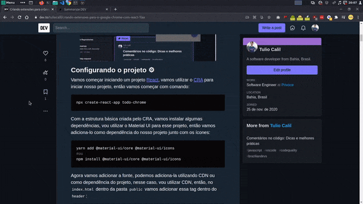

# Summaryze Forem 📑

<p align="center">
  
</p>

<p align="center">


</p>

## About it📖

Inspired on my [friend](https://github.com/Cledersonbc) project: [Summaryze](https://github.com/autociencia/summaryze), Summaryze Forem is a tool write on javascript with [NextJS](https://nextjs.org/) that use web scrap to get all anchor links from a post on [forem](https://www.forem.com/) plataforms(like dev.to), format it and create a markdown summary fast and easy.
I have this necessity after write [this post](https://dev.to/tuliocalil/criando-extensoes-para-o-google-chrome-com-react-1laa) and being too lazy to do the summary, so i decide to create this tool, hope you like it.

[Here](https://www.figma.com/file/ywNwI4gYMH3cXiUIZ9ZiuS/summaryze-dev?node-id=0%3A1) you can see the figma prototype.

### Frameworks and Libs 🛠

- Nextjs
- Node Fetch
- Cheerio
- React Tabs
- React Toastify
- React Icons
- ...

## How to use it ❓

Check [here](https://summaryze-forem.vercel.app/#how-to-use-it) a quick guide.

## Install 🚀

Clone the project:

```sh
git clone https://github.com/tuliocll/summaryze-forem.git
```

Navigate to project folder and install dependencies:

```sh
cd summaryze-forem

yarn
#or
npm install
```

Run the project on dev mode:

```sh
yarn dev
#or
npm run dev
```

### Buy me a coffe! ☕

[
](https://ko-fi.com/tuliocll)

<div align="center">

### Made with 💙 in Bahia, Brasil.

</div>
